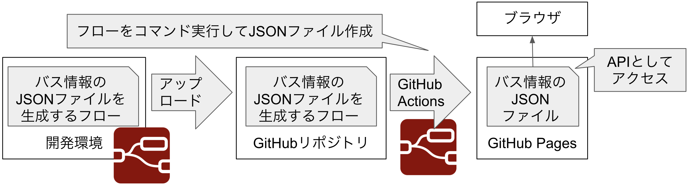
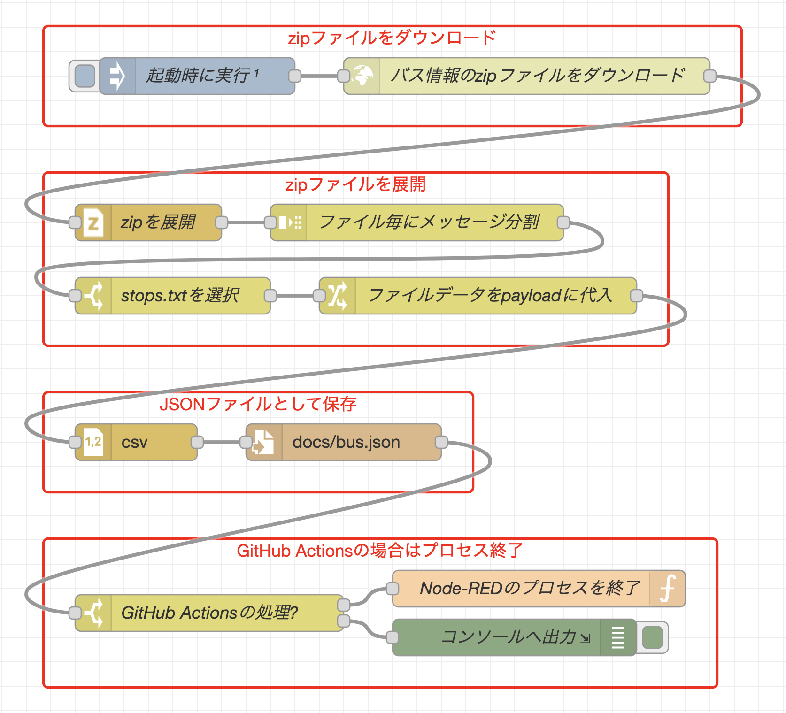
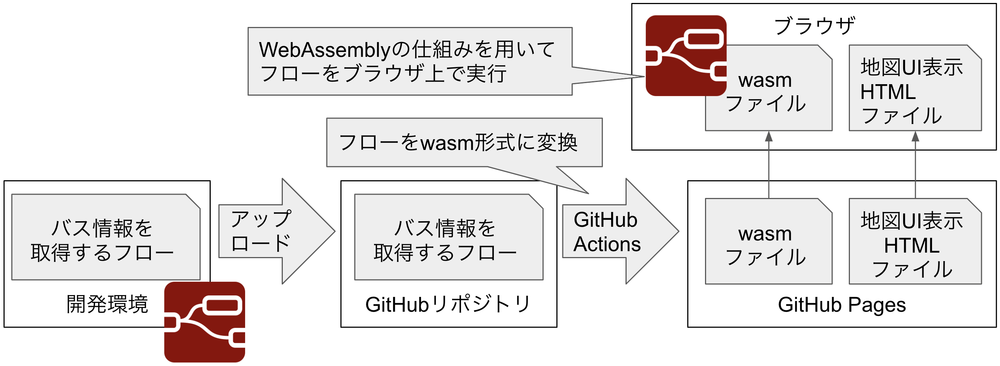
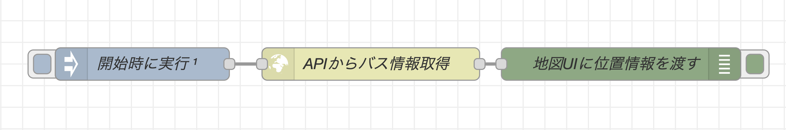

# バス停の位置情報を地図上に可視化
## 概要
愛知県小牧市の下記ページに公開されているバス情報のオープンデータを用いて、バス停の位置情報を地図上に可視化

http://www.city.komaki.aichi.jp/admin/soshiki/toshiseisakubu/toshiseibi/2/opendata/17331.html

## 課題と解決方法

- バス情報はZIPファイル内に格納されており、ZIP展開が必要

  -> [node-red-contrib-zip](https://flows.nodered.org/node/node-red-contrib-zip)を用いて、Node-REDのフローでZIPファイルを展開

- バス情報はCSVファイルのため、REST APIとしてアクセスしにくい

  -> Node-REDでCSVをJSON形式に変換し、GitHub PagesでJSONファイルを公開

- CSVをJSON形式に変換するフローを、元データ更新の度に実行するのは大変

  -> フローをコマンドとして実行することで、GitHub Actionsでの定期実行を実現

- [worldmapノード](https://flows.nodered.org/node/node-red-contrib-web-worldmap)を用いて可視化すると公開した場合、Node-REDの常時起動が必要

  -> スタンドアロンで動作する[WebAssembly版Node-RED](https://github.com/kazuhitoyokoi/node-red-wasm)を用いて、ブラウザ上でフローを実行

## 実装の詳細

### バス停の位置情報を取得できるREST API

1. 下記フローを開発し、GitHub上にアップロード

   **バス停情報が格納されているzipファイルを取得、展開し、JSONファイルとして保存するフロー**
   
   

2. [GitHub Actionsを用いて](.github/workflows/create-api.yml#L17)フローをコマンドとして実行

   GitHub Actions上で実行するとプロセスを終了させる処理をフローに追加することで、コマンドライクにフローを実行できるようになっている。

3. バス停情報のJSONファイルを、静的ファイルとしてGitHub Pages上へ公開

    -> https://kazuhitoyokoi.github.io/node-red-ogiri-nagoya/bus.json からアクセス可能

### REST APIから取得したバス停の位置情報を可視化する地図UI

1. 下記フローを開発し、GitHub上にアップロード

   **REST APIからパス停の位置情報を取得するフロー**
   
  

2. WebAssembly版Node-REDを用いてwasmファイルへ変換

3. wasmファイルと地図表示UIのHTMLファイルを、静的ファイルとしてGitHub Pages上に公開

-> https://kazuhitoyokoi.github.io/node-red-ogiri-nagoya/bus.htm からアクセス可能

※補足: [worldmapノードを用いて実装したケース](general.md)